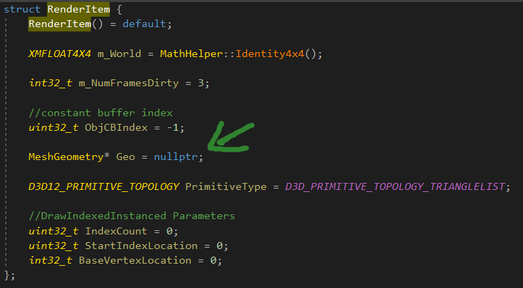
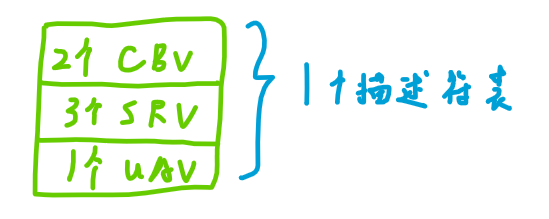

程序化几何体，对于绘制天空穹顶、图形程序调试、碰撞检测的可视化以及**延迟渲染**都是有用的。


GeometryGenerator类可以**生成**后续章节用到的顶点数据。


GeometryGenerator里面有个Vertex和和MeshData，**MeshData包含了内存中的顶点数据和索引数据。**


ShapesApp::BuildShapeGeometry根据GeometryGenerator创建MeshGeometry，

MeshGeometry包含了GPU的数据，CPU的数据，以及一个

```c++
std::unordered_map<std::string, SubmeshGeometry> DrawArgs;
```


SubmeshGeometry只包含三个参数，用来绘制的，**MeshGeometry是一个几何体的集合。**


后续，用unordered_map进行着色器、PSO、几何体的映射，这样很方便，**根据名字进行常数时间的查找。**




然后根据MeshGeometry构建渲染项。


**ObjCBIndex是常量缓冲区索引。**


# 帧资源和常量缓冲区视图


我们有一个FrameResource数组，FrameResource中有上传缓冲区，**为场景中的每个渲染项存储渲染过程常量以及物体常量数据。**


```c++
std::unique_ptr<UploadBuffer<PassConstants>> PassCB = nullptr;
std::unique_ptr<UploadBuffer<ObjectConstants>> ObjectCB = nullptr;
```


创建描述符堆，描述符的数量也要更改，还有常量缓冲区描述符。

描述常量缓冲区描述符创建的结构体指向ID3D12Resource资源的地址，**然后再指向描述符堆的句柄，然后创建描述符。**


# 根签名

根签名定义了：在绘制调用之前，需要绑定到渲染流水线上的资源，以及这些资源应该**如何映射到着色器的输入寄存器中。**


## 根参数

根签名是由一系列根参数定义而成的。


根参数有3个类型：

1.描述符表

2.根描述符

3.根常量


代码中要填写CD3DX12_ROOT_PARAMETER结构体来**描述根参数。**


CD3X12_ROOT_PARAMETER是对结构体D3D12_ROOT_PARAMETER进行扩展，并增加一些**辅助初始化函数**而得来的。


```c++
typedef struct D3D12_ROOT_PARAMETER
{
	D3D12_ROOT_PARAMETER_TYPE ParameterType;
	union
	{
		D3D12_ROOT_DESCRIPTOR_TABLE DescriptorTable;
		D3D12_ROOT_CONSTANTS Constants;
		D3D12_ROOT_DESCRIPTOR Descriptor;
	};
	D3D12_SHADER_VISIBILITY ShaderVisibility;
}D3D12_ROOT_PARAMETER;
```


1.ParameterType，用于指示根参数的类型，**描述符表、根常量、CBV根描述符、SRV根描述符、UAV根描述符。**


2.DescriptorTable/Constants/Descriptor:描述根参数的结构体。


D3D12_ROOT_DESCRIPTOR_TABLE，根描述符表。

```c++
typedef struct D3D12_ROOT_DESCRIPTOR_TABLE
{
	UINT NumDescriptorRanges;
	const D3D12_DESCRIPTOR_RANGE *pDescriptorRanges;
}D3D12_ROOT_DESCRIPTOR_TABLE;
```


D3D12_DESCRIPTOR_RANGE，描述符区域。

```c++
typedef struct D3D12_DESCRIPTOR_RANGE
{
	D3D12_DESCRIPTOR_RANGE_TYPE RangeType;
	UINT NumDescriptors;
	UINT BaseShaderRegister;
	UINT RegisterSpace;
	UINT OffsetInDescriptorsFromTableStart;
}D3D12_DESCRIPTOR_RANGE;
```


BaseShaderRegister是描述符范围要绑定到的**基准着色器范围。**




一个描述符可以由多个描述符区域数组组成。


## 根描述符

```C++
typedef struct D3D12_ROOT_DESCRIPTOR
{
	UINT ShaderRegister;
	UINT RegisterSpace;
}D3D12_ROOT_DESCRIPTOR;
```


ShaderRegister为描述符**要绑定的着色器寄存器。**


```c++
//描述符表需要在描述符堆中设置对应的描述符句柄
//根描述符，只需要简单而又直接地绑定资源的虚拟地址即可
UINT objCBByteSize = d3dUtil::CalcConstantBufferByteSize(sizeof(ObjectConstants));

D3D12_GPU_VIRTUAL_ADDRESS objCBAddress = objectCB->GetGPUVirtualAddress();

objCBAddress += ri->objCBIndex * objCBByteSize;

cmdList->SetGraphicsRootConstantBufferView(
0,//根参数索引
objCBAddress
);
```


根描述符，不需要创建描述符堆和绑定描述符堆。


## 根常量

```c++
typedef struct D3D12_ROOT_CONSTANTS
{
	UINT ShaderRegister;
	UINT RegisterSpace;
	UINT Num32BitValues;
}D3D12_ROOT_CONSTANTS;
```


```c++
CD3DX12_ROOT_PARAMETER slotRootParameter[1];

//12个根常量
slotRootParameter[0].InitAsConstants(12, 0);

cmdList->SetGraphicsRoot32BitConstants(0, 1, &blurRadius, 0);
```


第三个函数，是绑定的过程，第一个参数是根参数的索引，第二个是常量数据的个数，第三个是常量数据数组，

第三个是着色器的偏移位置。


传递**根实参**：

```C++
cmdList->SetGraphicsRootDescriptorTable(0, cbvHandle);
```


