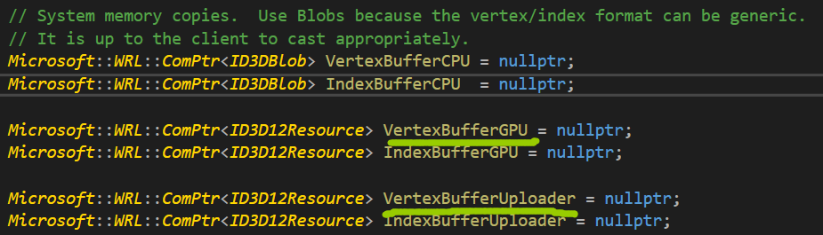

#  顶点与输入布局

定义了顶点结构体之后，需要向Direct3D提供该顶点结构体的描述，使它了解应该怎样来处理结构体中的每个成员。称为**输入布局描述(input layout description)。**


用结构体D3D12_INPUT_LAYOUT_DESC来表示。

```c++
typedef struct D3D12_INPUT_LAYOUT_DESC
{
	const D3D12_INPUT_ELEMENT_DESC* pInputElementDesc;
	UINT NumElements;
}D3D12_INPUT_LAYOUT_DESC;
```


D3D12_INPUT_ELEMENT_DESC描述了顶点结构体中对应的成员：

```c++
typedef struct D3D12_INPUT_ELEMENT_DESC
{
	LPCSTR SemanticName;//语义名
	UINT SemanticIndex;//语义索引
	DXGI_FORMAT Format;//顶点元素格式
	UINT InputSlot;//输入槽，暂时为0，练习里面有介绍
	UINT AlignedByteOffset;//顶点在顶点结构体中的偏移量
	D3D12_INPUT_CLASSIFICATION InputSlotCass;//实例化用
	UINT InstanceDataStepRate;//实例化用
}D3D12_INPUT_ELEMENT_DESC;
```


# 顶点缓冲区

为了使GPU可以访问顶点数组，需要把它放置在称为缓冲区的GPU资源(ID3D12Resource)里面。


通过填写D3D12_RESOURCE_DESC结构体来描述缓冲区资源，接着再调用ID3D12Device::CreateCommittedResource方法创建ID3D12Resource资源。


Direct3D 12提供了一个C++包装类CD3DX12_RESOURCE_DESC，它派生自D3D12_RESOURCE_DESC结构体，

带有多种便于使用的构造函数以及方法。

```c++
static inline CD3DX12_RESOURCE_DESC Buffer(
UINT64 width,
D3D12_RESOURCE_FLAGS flags = D3D12_RESOURCE_FLAG_NONE,
UINT64 alignment = 0
)
{
	return CD3D12_RESOURCE_DESC(D3D12_RESOURCE_DIMENSION_BUFFER,
	alignment, width, 1, 1, 1,
	DXGI_FORMAT_UNKNOWN, 1, 0,
	D3D12_TEXTURE_LAYOUT_ROW_MAJOR, flags);
}
```


width表示缓冲区所占的字节数。

Buffer这个函数，用来返回一个描述创建缓冲区的描述结构体。


缓冲区用D3D12_RESOURCE_DIMENSION_BUFFER类型来表示，而2D纹理则以D3D12_RESOURCE_DIMENSION_TEXTURE2D来表示。


顶点缓冲区资源这种类型是默认堆，除了创建顶点缓冲区资源本身以外，

我们还需要用D3D12_HEAP_TYPE_UPLOAD这种堆类型，

创建一个处于中介位置的**上传缓冲区资源。**


```c++
Microsoft::WRL::ComPtr<ID3D12Resource> d3dUtil::CreateDefaultBuffer
(
	ID3D12Device* device,
	ID3D12GraphicsCommandList* cmdList,
	const void* initData,
	UINT64 byteSize,
	Microsoft::WRL::ComPtr<ID3D12Resource>& UpoladBuffer
)
{
	//默认堆
	ComPtr<ID3D12Resource> defaultBuffer;
	
	//创建实际的默认缓冲区资源
	ThrowIfFailed(device->CreateCommittedResource(
	&CD3DX12_RESOUCE_PROPERTIES(D3D12_HEAP_TYPE_DEFAULT),
	D3D12_HEAP_FLAG_NONE,
	&CD3D12_RESOURCE_DESC::Buffer(byteSize),
	D3D12_RESOURCE_STATE_COMMON,//资源状态
	nullptr,
	IID_PPV_ARGS(defaultBuffer.GetAddressOf())
	));

	//创建中介堆
	ThrowIfFailed(device->CreateCommittedResource(
	&CD3DX12_RESOURCE_PROPERTIES(D3D12_HEAP_TYPE_UPLOAD),
	D3D12_HEAP_FLAG_NONE,
	&CD3DX12_RESOURCE_DESC::Buffer(byteSize),
	D3D12_RESOURCE_STATE_GENERIC_READ,//这里
	nullptr,
	IID_PPV_ARGS(uploadBuffer.GetAddressOf())
	));
	
	//描述我们希望复制到默认缓冲区的数据
	D3D12_SUBRESOURCE_DATA subResourceData = {};
	subResourceData.pData = initData;//这里，关键，从内存拷贝数据
	subResourceData.RowPitch = byteSize;//要复制的字节数
	subResourceData.SlicePitch = subResourceData.RowPitch;
	
	//将数据复制到默认缓冲区资源的流程
	//UpdateSubresources辅助函数会先将数据从CPU端的内存中复制到位于中介位置的上传堆里，
	//接着通过调用ID3D12CommandList::CopySubresourceRegion函数，把上传堆内的数据复制到
	//mBuffer中
	cmdList->ResourceBarrier(1,
    &CD3DX12_RESOURCE_BARRIER::Transition(defaultBuffer.Get(),
    D3D12_RESOURCE_STATE_COMMON,
    D3D12_RESOURCE_STATE_COPY_DST));
    
    //关键
    UpdateSubresources<1>(cmdList,
    defaultBuffer.Get(), uploadBuffer.Get(),
    0, 0, 1, &subResourceData);
    
    cmdList->ResourceBarrier(1,
    &CD3DX12_RESOURCE_BARRIER::Transition(defaultBuffer.Get(),
    D3D12_RESOURCE_STATE_COPY_DEST
    D3D12_RESOURCE_STATE_GENERIC_READ));
    
    //调用完上述函数后，必须保证uploadbuffer还存在，因为命令列表的命令还未执行，
    //等执行完毕后，再释放
    return defaultBuffer;
}
```


```c++
typedef struct D3D12_SUBRESOURCE_DATA
{
	const void* data,//指向内存块的数据
	LONG_PTR RowPitch,
	LONG_PTR SlicePitch
}D3D12_SUBRESOURCE_DATA;
```



VertexBufferGPU：默认堆

VertexBufferUploader：上传堆


为了将顶点缓冲区绑定到渲染流水线上，需要给这种资源创建一个顶点缓冲区视图，**和RTV一样，**

无须为顶点缓冲区视图创建描述符堆。顶点缓冲区视图是由D3D12_VERTEX_BUFFER_VIEW结构体来表示的。


```c++
typedef struct D3D12_VERTEX_BUFFER_VIEW{
	D3D12_GPU_VIRTUAL_ADDRESS BufferLocation,//buffer的虚拟地址
	UINT SizeInBytes,//顶点缓冲区大小
	UINT StrideInBytes//一个顶点的字节数
}D3D12_VERTEX_BUFFER_VIEW;
```


第一个参数，可以通过ID3D12Resource::GetGPUVirtualAddress方法来获得此地址。


在顶点缓冲区及其对应视图创建完成后，便可以将它与渲染流水线上的一个**输入槽**相互绑定。

```c++
void ID3D12GraphicsCommandList::IASetVertexBuffers(
UINT StartSlot,
UINT NumView,
const D3D12_VERTEX_BUFFER_VIEW* pViews
);
```

第一个参数开始的槽位会和第三个参数依依绑定。


**//后续有个小作业，会使用多个槽**


最后一步是通过ID3D12GraphicsCommandList::DrawInstanced方法来绘制顶点。

```c++
void ID3D12GraphicsCommandList::DrawInstanced(
UINT VertexCountPerInstance,//每个实例要绘制的顶点数量
UINT InstanceCount,//暂时为1
UINT StartVertexLocation,//指定顶点缓冲区内第一个被绘制顶点的索引
UINT StartInstanceLocation//暂时为0，实例化用
);
```


我们还要指定一下图元拓扑：

```c++
cmdList->IASetPrimitiveTopology(D3D_PRIMTIVE_TOPLOGY_TRAINGLELIST);
```


# 索引缓冲区

也是ID3D12Resource来存放索引数据。


为了使索引缓冲区与渲染流水线相绑定，需要给索引缓冲区资源创建一个索引缓冲区视图(index buffer view)。


索引缓冲区视图由结构体D3D12_INDEX_BUFFER_VIEW来表示。

```C++
typedef struct D3D12_INDEX_BUFFER_VIEW
{
	D3D12_GPU_VIRTUAL_ADDRESS BufferLocation,
	UINT SizeInBytes,
	DXGI_FORMAT Format
}D3D12_INDEX_BUFFER_VIEW;
```


```c++
mCommandList->IASetIndexBuffer(&ibv);
```


使用DrawIndexedInstanced来代替DrawInstanced方法进行绘制。


# 顶点着色器示例

```c++
cbuffer cbPerObject : register(b0)
{
	float4x4 gWorldViewProj;
};

void VS(float3 iPosL : POSITION,
		float4 iColor : COLOR,
		out float4 oPosH : SV_POSITION,
		out float4 oColor : COLOR)
{
	//把顶点变换到齐次裁剪空间
	oPosH = mul(float(iPosL, 1.0f), gWorldViewProj);
	
	//直接将顶点的颜色信息输出到像素着色器
	oColor = iColor;
}
```


注意关键字，out是输出参数。在HLSL中，所有的函数都是内联函数。


矩阵变量gWorldViewProj存于**常量缓冲区**内。


顶点输入布局描述必须和顶点着色器中的一致，Direct3D会验证两者是否一致，

**创建ID3D12PipelineState的时候，会进行验证。**


# 像素着色器示例

光栅化处理期间会对顶点着色器输出的顶点属性**进行插值**。随后，再将这些插值数据传至像素着色器中作为它的输入。


像素着色器输入的是像素片段，输出的是像素。


像素片段会进行竞争，比如执行深度测试，调用discard，并不会真正地写入像素。


```c++
float4 PS(float4 posH : SV_POSITION, float4 color : COLOR) : SV_Target
{
	return color;
}
```


**SV_Target，表示返回值的类型应当与渲染目标格式相互匹配。**


# 常量缓冲区


常量缓冲区是一种GPU资源，其数据内容可供着色器程序所引用。


常量缓冲区通常由CPU每帧更新一次。

我们需要把常量缓冲区创建到一个上传堆而非默认堆中，**注意，这里，顶点数据是创建到默认堆的。**

常量缓冲区的大小必须为硬件最小分配空间(256B)的整数倍。


CalcConstantBufferByteSize用来计算常量缓冲区的大小。


HLSL会自行进行填充。


# 更新常量缓冲区

常量缓冲区是用D3D12_HEAP_TYPE_UPLOAD这种堆类型来创建的，**我们能通过CPU为常量缓冲区资源更新数据。**


首先要获得指向欲更新资源数据的指针，用Map方法来做到这一点：

```c++
ComPtr<ID3D12Resource> mUploadBuffer;
BYTE* mMappedData = nullptr;
mUploadBuffer->Map(0, nullptr, reinterpret_cast<void**>(&mMappedData));
```


第一个参数是子资源索引，指定了欲映射的子资源。对于缓冲区来说，它自己本身就是子资源。

第二个参数是可选项，指向D3D12_RANGE结构体的指针，此结构体描述了内存的映射范围，若将该参数指定为空指针，则对整个资源进行映射。


```c++
memcpy(&mMappedData, &data, dataSizeInBytes);
```


当常量缓冲区更新完毕之后，我们应在释放映射内存之前对其进行unmap操作。

```c++
if(mUploadBuffer != nullptr)
	mUploadBuffer->Unmap(0, nullptr);
	
mMappedData = nullptr;
```


# 上传缓冲区辅助函数


UploadBuffer.h封装了上传缓冲区，实现了上传缓冲区的构造与析构，处理资源的映射和取消映射关系，

提供了**CopyData**方法来更新缓冲区内的特定元素。


# 常量缓冲区描述符


利用描述符将常量缓冲区绑定至渲染流水线上。

常量缓冲区描述符要存放在以D3D12_DESCRIPTOR_HEAP_TYPE_CBV_SRV_UAV类型所创建的描述符堆里面。

为了存放这些新类型的描述符，我们需要为之创建以下类型的新式描述符堆：

```c++
D3D12_DESCRIPTOR_HEAP_DESC cbvHeapDesc;
cbvHeapDesc.NumDescriptors = 1;
cbvHeapDesc.Type = D3D12_DESCRIPTOR_HEAP_TYPE_CBV_SRV_UAV;
cbvHeapDesc.Flags = D3D12_DESCRIPTOR_HEAP_FLAG_SHADER_VISIBLE;
cbvHeapDesc.NodeMask = 0;

ComPtr<ID3D12ResourceHeap> mCbvHeap;
md3dDevice->CreateDescriptorHeap(&cbvHeapDesc,
IID_PPV_ARGS(&mCbvHeap));
```


再通过调用ID3D12Device::CreateConstantBufferView方法，便可以创建常量缓冲区：

```c++
//绘制物体所用的常量数据
struct ObjectConstants
{
    XMFLOAT4X4 WorldViewProj = MathHelper::Identity4x4();
};

//此常量缓冲区存储了绘制n个物体所需的常量数据
std::unique_ptr<UploadBuffer<ObjectConstants>> mObjectCB = nullptr;
mObjectCB = std::make_unique<UploadBuffer<ObjectConstants>>
(md3dDevice.Get(), n, true);

UINT objCBByteSize = d3dUtil::CalcConstantBufferByteSize(sizeof(ObjectConstants));

//缓冲区的起始地址
D3D12_GPU_VIRTUAL_ADDRESS cbAddress = mObjectCB->Resource()->
    GetGPUVirtualAddress();

//偏移到常量缓冲区中绘制第i个物体所需的常量数据
int boxCBufIndex = i;
cbAddresss += boxCBufIndex * objCBByteSize;

D3D12_CONSTANT_BUFFER_VIEW_DESC cbvDesc;
cbvDesc.BufferLocation = cbAddress;
cbvDesc.SizeInBytes = d3dUtil::CalcConstantBufferByteSize(sizeof(ObjectConstants));

md3dDevice->CreateConstantBufferView(
&cbvDesc,
mCbvHeap->GetCPUDescriptorHandleForHeapStart()
);
```


描述符结构体存储了常量缓冲区的GPU地址，**然后创建描述符是创建在描述符堆里面的。**


# 根签名和描述符表


在绘制调用开始之前，我们应将不同的着色器程序所需的各种类型的资源绑定到渲染流水线上。

不同类型的资源会被绑定到特定的寄存器槽上，以供着色器程序使用。


根签名的定义是：在执行绘制命令之前，那些应用程序将绑定到渲染流水线上的资源，

**它们会被映射到着色器的对应输入寄存器。**


根签名用ID3D12RootSignature接口来表示，并以一组描述绘制调用过程中着色器所需资源的**根参数**定义而成。


根参数可以是根常量、根描述符或者描述符表。


描述符表指定的是描述符堆中**存有描述符的一块连续区域。**

```c++
//根参数可以是描述符表、根描述符或者根常量
CD3DX12_ROOT_PARAMETER slotRootParameter[1];

//创建一个只存有一个CBV的描述符表
CD3DX12_DESCRIPTOR_RANGE cbvTable;
cbvTable.Init(
D3D12_DESCRIPTOR_RANGE_TYPE_CBV,
1,//表中的描述符数量
0//将这段描述符区域绑定至此基准着色器寄存器
);

slotRootParameter[0].InitAsDescriptorTable(
1,//描述符区域的数量
&cbvTable);//指向描述符区域的数组

//根签名由一组根参数组成
CD3DX12_ROOT_SIGNATURE_DESC rootSigDesc(1, slotRootParameter, 0, nullptr,
D3D12_ROOT_SIGNATURE_FLAG_ALLOW_INPUT_ASSEMBLER_INPUT_LAYOUT);

//创建一个仅含槽位的根签名
ComPtr<ID3DBlob> serializeRootSig = nullptr;
ComPtr<ID3DBlob> errorBlob = nullptr;

HRESULT hr = D3D12SerializeRootSignature(&rootSigDesc,
D3D_ROOT_SIGNATURE_VERSION_1,
seralizerdRootSig.GetAddressOf(),
errorBlob.GetAddressOf());

ThrowIfFailed(md3dDevice->CreateRootSignature(
0,
serializerRootSig->GetBufferSize(),
IID_PPV_ARGS(&mRootSignature)
));
```


```C++
CD3DX12_ROOT_PARAMETER slotRootParameter[1];

CD3DX12_DESCRIPTOR_RANGE cbvTable;
cbvTable.Init(
D3D12_DESCRIPTOR_RANGE_TYPE_CBV,//描述符表的类型
1,//表中描述符的数量
0//将这段描述符区域绑定至此基址着色器寄存器
);
slotRootParameter[0].InitAsDescriptorTable(
1,//描述符区域的数量
&cbvTable//指向描述符区域数组的指针
);
```

根参数，目的是将含有一个CBV的描述符表绑定到常量缓冲区寄存器0。


根签名只定义了应用程序要绑定到渲染流水线的资源，**却没有真正地执行任何资源的绑定。**

只要率先通过命令列表设置好根签名，我们就能用ID3D12GraphicsCommandList::SetGraphicsRootDescriptorTable方法令描述符表与渲染流水线相互绑定。


```c++
mCommandList->SetGraphicsRootSignature(mRootSignature.Get());

ID3D12DescriptorHeap* descriptorHeaps[] = {mCBVHeap.Get()};

mCommandList->SetDescriptorHeaps(_countof(descriptorHeaps),
descriptorHeaps);

//偏移至此次绘制调用所需的CBV处
CD3DX12_GPU_DESCRIPTOR_HANDLE cbv(mCbvHeap->GetGPUDescriptorHandleForHeapStart());

cbv.Offset(cbvIndex, mCbvSrvUavDesscriptorSize);

//根参数索引和相应的描述符堆句柄
mCommandList->SetGraphicsRootDescriptorTable(0, cbv);
```


所以，根签名由根参数组成，根参数由描述符表初始化，描述符表描述了描述符堆里面的描述符数量，

以及要绑定的寄存器槽号。


然后运行的时候，绑定根签名，**以及绑定真正的资源，描述符堆。**


# 编译着色器

在Direct3D中，着色器程序必须先被编译为一种可移植的字节码。

可以在运行期间用下列函数对着色器进行编译：

```c++
HRESULT D3DCompileFromFile(
LPCWSTR pFileName,
const D3D_SHADER_MACRO* pDefines,
ID3DInclude* pInclude,
LPCSTR pEntryPoint,
LPCSTR pTarget,
UINT Flags1,
UINT Flags2,
ID3DBlob **ppCode,
ID3DBlob **ppErrorMsgs
);
```


第二个和第三个暂时为空，后面用到。

第四个是着色器的入口点函数名。

第五个指定着色器类型和版本的字符串。

第六个指示对着色器代码应当如何编译的标志。

第七个暂时为空。

第八个存储编译好的着色器对象字节码。

第九个存储报错的字符串。


d3dUtil.h/.cpp提供了CompileShader这个函数用来编译着色器。


离线编译//208。


# 光栅器状态

光栅器状态由结构体D3D12_RASTERIZER_DESC来表示。


```c++
CD3D12_RASTERIZER_DESC rsDesc(D3D12_DEFAULT);
rsDesc.FillMode = D3D12_FILL_MODE_WIREFRAME;
rsDesc.CullMode = D3D12_CULL_MODE_NONE;
```


# 流水线状态对象


流水线状态对象，用ID3D12PipelineState接口来表示。

要创建PSO，我们需要填写D3D12_GRAPHICS_PIPELINE_STATE_DESC结构体实例。


大部分参数可以用D3D12_DEFAULT填充。


```c++
//重置命令列表并指定PSO
mCommandList->Reset(mDirectCmdListAlloc.Get(), mPSO1.Get());
```


