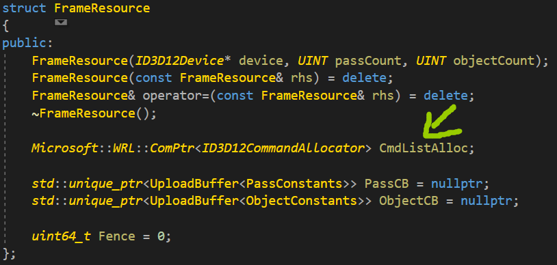
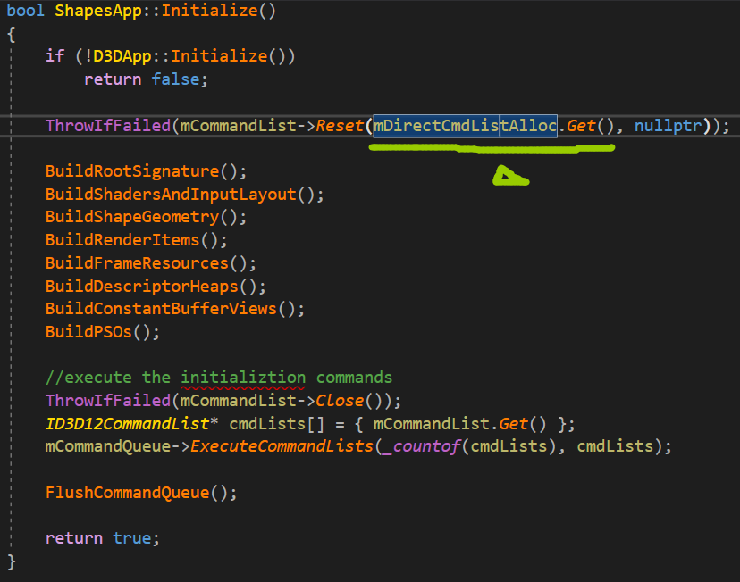
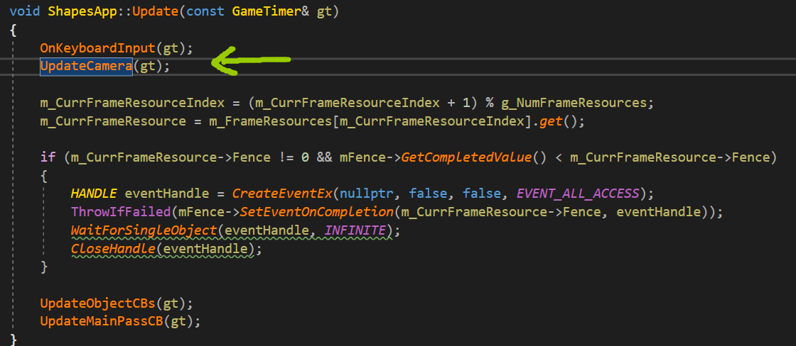
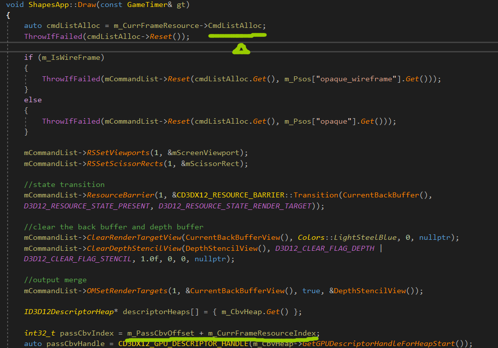
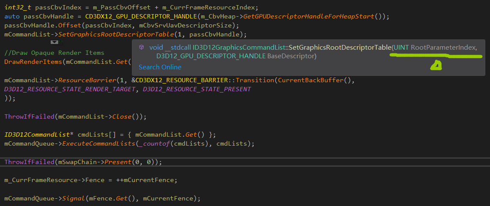
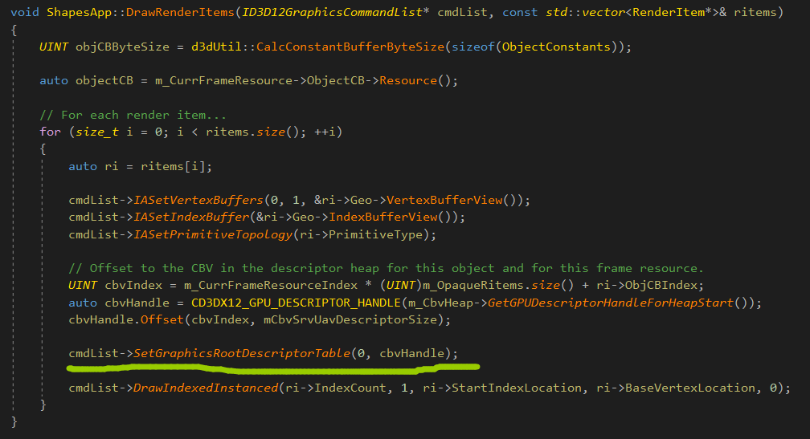

# 利用Direct3D绘制几何体

## 帧资源

以CPU**每帧都需要更新的资源**作为基本元素，创建一个环形数组。

这些资源为帧资源。

如果帧资源数组共有3个元素，**则令CPU比GPU提前处理两帧。**

"Shapes"程序示例，此例中CPU只需要修改常量缓冲区，所以程序中的帧资源类**只含有常量缓冲区。**

每个帧资源都有一个命令分配器，说明命令列表和命令队列只要一个就行，而命令分配器是多份的。

初始化的时候，首先重置命令列表，这个mDirectCmdListAlloc是整个app用来初始化和绘制的命令分配器，**后面pso状态为nullptr。**

更新过程，首先更新输入和摄像机，再更新常量缓冲区。

从帧资源中拿出命令分配器，然后描述符句柄绑定到流水线。

将描述符句柄绑定到1号根参数，1号根参数是一个**描述符表。**

所以，着色器相当于一个函数，而根签名描述了这个函数的参数，**即资源绑定到流水线上的参数。**

最后一个命令，Signal，从GPU端设置一条命令，加入到命令队列中，只要在命令队列之前的命令执行完毕后，才会执行这一条。

另一个绑定的过程在这，将描述符绑定到根参数0上。

设置PSO的状态时，有个设置渲染目标个数的参数，设置为1，**表示当前渲染的个数。**

