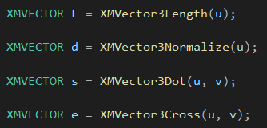

在摄像机中，可以以摄像机的方向，来**规范化**其它两个向量。


# 利用DirectXMath库进行向量运算


该数学库采用了SIMD流指令扩展2(Streaming SIMD Extensions 2, SSE2)指令集。

借助128位宽的单指令多数据(Single Instruction Multiple Data, SIMD)寄存器，

利用一条**SIMD指令**即可同时对4个32位浮点数或者整数进行运算。


<<Designing Fast Cross-Platform Vector Libraries(设计快速的跨平台SIMD向量库)>>。


**使用DirectXMath库**，我们需要向代码中添加头文件#include&lt;DirectXMath.h&gt;，

为了一些相关的数据类型，还要加入#include&lt;DirectXPackedVector.h&gt;，所有的代码以内联的方式实现在头文件中。


DirectXMath.h文件中的代码都存在于DirectX命名空间中，而DirectXPackedVector.h文件中的代码则都位于、

DirectX::PackedVector命名空间以内。


开启SIMD。


## 向量类型

DirectXMath中，核心的向量类型是XMVECTOR，它将被映射到**SIMD硬件寄存器**。

此类型的定义：

```c++
typedef __m128 XMVECTOR;
```


对于类中的数据成员，使用XMFLOAT2、XMFLOAT3、XMFLOAT4类型加以替代。


1. 局部变量或全局变量用XMVECTOR类型。
2. 对于类中的数据成员，使用XMFLOAT2、XMFLOAT3和XMFLOAT4类型。
3. 在运算之前，通过加载函数将XMFLOATn类型转换为XMVECTOR类型。
4. 用XMVECTOR实例进行运算。
5. 通过存储函数将XMVECTOR类型转换为XMFLOATn类型。


## 参数的传递

为了提高效率，可以将XMVECTOR类型的值作为函数，直接传送至SSE/SSE2寄存器里，而不是栈内。


使用FMVECTOR、GXMVECTOR、HXMVECTOR和CXMVECTOR类型来传递XMVECTOR类型的参数。


传递XMVECTOR参数的规则如下：

1. 前3个XMVECTOR参数应当用类型FXMVECTOR。
2. 第4个XMVECTOR参数应当用类型GXMVECTOR。
3. 第5、6个XMVECTOR参数应当用类型HXMVECTOR。
4. 其余的XMVECTOR参数应当用类型CXMVECTOR。


对于构造函数来说，前3个XMVECTOR参数用FXMVECTOR类型，其余XMVECTOR参数则用CXMVECTOR类型。

对于构造函数不要用XM_CALLCONV注解。


在XMVECTOR类型的参数之间，**可以掺杂其他非XMVECTOR类型的参数。**

此时，XMVECTOR参数的规则依然适用，而在统计XMVECTOR参数的数量时，会对其他类型的参数视若无睹。


传递XMVECTOR参数的规则仅适用于**输入**参数。


## 常向量

可以使用XMVECTOR**F**32类型来表示常量实例，常向量的初始化语法。


也可以通过XMVECTOR**U**32类型来创建由整形数据构成的XMVECTOR常向量：

```c++
static const XMVECTORU32 vGrabY = {
	0x00000000, 0xFFFFFFFF, 0x00000000, 0x00000000
};
```



大部分向量函数，会将结果存储在XMVECTOR里面，复制多次。


# 矩阵代数

针对规模更大的矩阵而言，要使用诸如**高斯消元法**等其他手段。


## 矩阵类型

XMMATRIX类来表示4x4矩阵，参与计算。


存储的时候，使用XMFLOAT4X4。


在声明具有XMMATRIX参数的函数时，除了要注意1个XMMATRIX应记作4个XMVECTOR参数这一点之外，

其他的规则与传入XMVECTOR类型的参数时相一致。


假设传入的函数的FXMVECTOR参数不超过两个，**则第一个XMMATRIX参数应当为FXMMATRIX类型，**

**其余的XMMATRIX参数应为CXMMATRIX类型。**


构造函数使用CXMMATRIX类型来获取XMMATRIX参数。


Direct3D采用的是**左手坐标系。**


